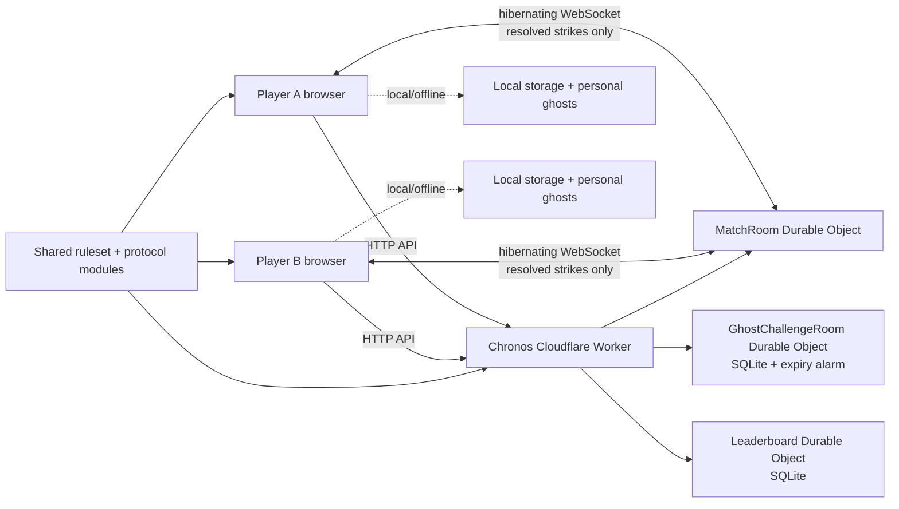

# Chronos Strike GameMode Revamp

## Cloudflare-only backend, multiplayer, ghost play, expanded cheat menu, cleanup, and family gameplay plan

> Implementation status, 2026-07-30: Phases 0-13 are implemented, tested, committed, pushed, and deployed. The Cloudflare leaderboard was deliberately reset to zero entries, the retired Gist was backed up and deleted, Ruleset 2 bounds ordinary score compounding without limiting private cheats, and mobile shell revision 4 forces returning phones onto the Cloudflare-only client. `OWNER_ACTIONS.md` is the production authority.

**Document status:** design and implementation complete; production verified  
**Scope:** `TheClockGame/GameMode/` only  
**Prepared:** 2026-07-30  
**Cost constraint:** Cloudflare Workers Free plan only; no paid services, ads, accounts, subscriptions, or usage-based overages  
**Recommended release target:** account-free family-and-friends web play, with local/offline single-player preserved

---

## 1. Executive decision

Revamp Chronos Strike in place as a static, no-build web game with one Cloudflare Worker backend. Keep all timing animation and input local. Use SQLite-backed Durable Objects for atomic leaderboards, asynchronous ghost challenges, and two-player live rooms. Use hibernating WebSockets only for live matches, and send resolved strike/round events rather than animation frames.

The current GitHub Gist path should be removed completely from active code and operations. The final browser must have no direct-Gist fallback, no Gist ID, no token fragments, and no GitHub API calls. Existing leaderboard data may be imported once from a manually exported JSON file and labelled `legacy_unverified`; the game must not retain a runtime dependency on that file or on GitHub Gist.

The default live mode should be a short **Chrono Clash**: two players, the same server-issued seed and difficulty, ten rounds, score-based victory, and synchronized sudden death for an exact tie. The existing 40-round Classic, Endless, Zen/Precision Lab, Daily Rift, personal ghosts, achievements, cosmetics, and offline play remain available.

Cheat mode is an intentional private trolling feature for the owner's inner group, not a competitive-integrity category. It must behave as follows:

- creator/GOD mode remains a separate local demo/QA feature and stays unranked;
- ordinary cheat mode never taints or reclassifies a run;
- cheat-assisted scores remain eligible for ordinary leaderboards, personal bests, Daily results, ghosts, achievements, and multiplayer results;
- leaderboards, opponent payloads, results, history, ghost cards, and share cards never disclose or label cheat use;
- an unlocked player may open the private cheat menu and enable, change, or disable individual effects at any point in any game mode, including a live multiplayer round;
- the cheat menu should follow StackFall's useful shape: a master active state, independent boolean toggles, multiplier/override selectors, quick actions, a local-only badge, session unlock, and a reset/disable-all action.

This is the same architectural direction proven in StackFall—static frontend, shared seeded gameplay, short room codes, capability-safe invitations, SQLite Durable Objects, hibernating WebSockets, milestone synchronization, cleanup alarms, kill switches, and real-browser tests—adapted to Chronos Strike's strike events, bosses, modifiers, replays, accessibility assists, and ruleset identity.

---

## 2. Scope boundary

### In scope

- every active file under `GameMode/`;
- splitting the 3,299-line `game.js` into understandable modules without changing gameplay accidentally;
- replacing the Gist-backed leaderboard with Cloudflare Durable Object storage;
- a versioned backend API and shared protocol;
- public leaderboards with correct competition partitions;
- server-issued Daily Rift identity;
- local personal-best ghosts and server-backed friend ghost challenges;
- account-free two-player live matches;
- creator/GOD access, private cheat access, an expanded toggle menu, and live effect changes;
- share links/cards for live and ghost results without private capabilities;
- security, privacy, rate limits, storage expiry, quota controls, test automation, deployment, rollback, and operational documentation;
- small gameplay improvements that reuse the existing engine and remain appropriate for family and friends.

### Explicitly out of scope

- Clock Quest or any file outside `GameMode/`;
- accounts, email, OAuth, Supabase, Firebase, paid databases, paid hosting, ads, purchases, or push notifications;
- moving the full repository or the main Clock Quest site;
- frame-by-frame network physics or remote-rendered gameplay;
- chat, voice, public matchmaking, strangers, clans, moderation systems, or permanent social profiles;
- pretending a browser game can be completely cheat-proof;
- changing scoring/balance during the structural cleanup phase;
- deploying or deleting live infrastructure without an explicit owner action.

### Static hosting assumption

“Move away from GitHub Gist” is treated as a backend-data requirement, not a request to move the repository or the static site. `GameMode/` can stay on its current static host while every dynamic feature moves to Cloudflare. Moving only the GameMode static assets to Cloudflare Pages can be evaluated later, but it is not needed for multiplayer and would broaden this task unnecessarily.

---

## 3. What exists now

### Strong foundations worth preserving

| Area | Current asset | Why it is valuable |
|---|---|---|
| Determinism | `engine.js`, seeded RNG, ruleset version, `simulateRun()` | Shared seeds can make Daily, ghost, and live rooms fair without streaming frames. |
| Core gameplay | Classic, Endless, Zen/Precision Lab, Hardcore, bosses, modifiers, powers, Overdrive | There is enough mechanical depth already; the revamp should organize it rather than replace it. |
| Ghost display | per-round strike recording, marker playback, score delta HUD | This is a good local playback model once its data and rendering are hardened. |
| Rival export | `encodeRival()` / `decodeRival()` | Provides a compatibility format and test fixtures for migration to short server-backed links. |
| Accessibility | reduced motion/flash/shake/particles, visual beat, large HUD, left-handed mode, colour-blind markers | Assists are already identified in run metadata and should remain distinct from cheats. |
| Meta systems | Daily Rift, achievements, cosmetics, local bests, sharing | These create retention without accounts or spending. |
| Offline behavior | local storage, local assets, soundtrack service worker | Single-player can remain playable when Cloudflare is unavailable. |
| Baseline tests | 1,746 deterministic assertions and a `game.js` load smoke test | A useful base for safe extraction, though not enough for online behavior. |

### Current architecture

```text
index.html
  -> engine.js                     deterministic helpers and replay codec
  -> game.js                       gameplay + UI + audio + storage + ghosts + cheats + Daily + meta
  -> leaderboard.js               local / direct Gist / Worker-proxied Gist client
  -> share.js                     local PNG result card

leaderboard-worker.js
  -> reads and rewrites one GitHub Gist
  -> verifies admin and cheat passphrases
```

There is no multiplayer room client, shared network protocol, Durable Object configuration, integration harness, or browser E2E suite in `GameMode/` today.

---

## 4. Risks and inconsistencies to resolve

These are implementation requirements, not optional polish.

| ID | Current issue | Impact | Planned resolution |
|---|---|---|---|
| R-001 | The Worker still reads and patches a GitHub Gist. | Lost updates are possible; GitHub remains a runtime dependency. | Replace with atomic SQLite-backed Durable Object writes and remove all Gist runtime code. |
| R-002 | The browser still supports direct Gist access and shipped token fragments. | A configured token would be public and writable by anyone. | Delete `gistId`, `gistFile`, `tokenParts`, GitHub API methods, and the direct mode. |
| R-003 | Client and Worker accept a claimed final score with few structural checks. | Malformed or absurd payloads can consume storage/quota. | Require a server-issued run identity and validate bounded event shape, ordering, ruleset identity, finite integers, monotonic progress, and generous safety caps. Deliberately do not recompute/reject scores under clean-only rules because legitimate private cheats alter those values. |
| R-004 | Classic, Endless, Normal, and Hardcore scores are displayed in one top-20 list. | Mechanically incomparable runs compete directly. | Partition boards by ruleset, playlist, difficulty, category, and period. |
| R-005 | The current cheat is one fixed package: hidden lives plus one score multiplier. | The owner cannot choose the joke/effect or adjust it during play. | Replace it with a StackFall-style menu of independent toggles, selectors, and quick actions that are read live by the engine. |
| R-006 | `runStats.cheat` exposes an internal cheat flag to the current Worker payload. | Future backend or UI code could reject, label, or accidentally reveal the troll. | Remove cheat status from every remote run, replay, progress, result, and leaderboard schema. Cheat state stays entirely inside the local game session. |
| R-007 | Current cheat behavior is not uniformly defined for Daily, Rival/ghost, Zen, GOD interaction, and multiplayer. | Some modes may disable, reject, expose, or inconsistently apply effects. | Define every cheat's behavior for every mode; allow ordinary cheats everywhere, keep GOD separate, and add cross-mode/multiplayer tests. |
| R-008 | Rival Codes are client-authored base64url values containing the claimed score and replay. | They are forgeable, long, unrevokable, and have no expiry/use policy. | Preserve a bounded v1 decoder only for local legacy import; use short Cloudflare challenge codes for new sharing. |
| R-009 | A decoded rival name reaches `ghostHud.innerHTML`. | A crafted Rival Code can inject markup into the page. | Render all remote names with `textContent`; sanitize and length-bound at decode and server boundaries; add an XSS regression test. |
| R-010 | Rival decode has no strict encoded-size, event-count, mode, identity, time, angle, score-progression, or ruleset bounds. | Memory/DOM abuse and nonsensical playback are possible. | Add strict shared replay schema and reject oversized or inconsistent records before rendering. |
| R-011 | The 3,299-line `game.js` owns unrelated systems and mutable global state. | Networking changes will be hard to reason about and regressions will be difficult to isolate. | Extract modules behind tests, introduce an immutable `RunContext`, and keep the pure engine shared. |
| R-012 | `leaderboard-worker.js` multiplexes leaderboard writes and secret verification at `/` with no route-level body caps or rate limits. | Abuse can consume free quota; failures are difficult to operate. | Versioned routes, byte caps, per-action limits, safe error codes, anonymous logs, and feature kill switches. |
| R-013 | Current rank is inferred from only the retained top 20. | “Global rank” can be incorrect beyond the displayed list. | Store enough rows for correct placement or report only top-20 qualification; do not invent an exact global rank. |
| R-014 | Player identity is handled by both `game.js` and `leaderboard.js`. | Duplicate forms and storage ownership can drift. | One identity/storage module; UI consumes it through a small API. |
| R-015 | Daily identity is computed only on the client. | A modified clock can target another date and offline results are indistinguishable from online Daily results. | Worker issues the authoritative UTC day/seed for ranked Daily; offline Daily remains local-only and labelled. |
| R-016 | The service worker caches only soundtrack files, and `Normal.mp3` is referenced but absent. | Offline behavior is partial and normal music silently falls back. | Decide deliberately between procedural Normal music or adding a licensed/local asset; document the choice and expand offline shell caching only after multiplayer is stable. |
| R-017 | There are no online integration, real WebSocket, concurrency, reconnect, mobile rotation, or two-browser tests. | “Works locally” cannot establish multiplayer correctness. | Add Worker unit/integration tests, Playwright with isolated contexts, and a two-phone release checklist. |
| R-018 | Remote data has no explicit deletion/retention policy. | Names, rooms, and replays can live longer than intended. | Expiry alarms, bounded leaderboard retention, admin removal, and documented storage periods. |
| R-019 | `style.css` is 2,093 lines and mixes foundations, screens, responsive rules, modes, overlays, accessibility, ghosts, and effects. | Multiplayer UI additions will increase cascade collisions and make mobile regressions harder to isolate. | Split CSS by stable concern with an explicit cascade order and visual regression coverage. |

---

## 5. Target architecture



### Core principles

1. **Local input remains immediate.** The browser animates the clock and resolves taps locally.
2. **The server owns competition identity.** It issues room/run IDs, seeds, ruleset, playlist, difficulty, start time, seat capabilities, expiry, and final comparison.
3. **Synchronize decisions, not pixels.** Send ready state, countdown, resolved strikes/rounds, score snapshots, finish, disconnect, forfeit, and rematch. Never send animation frames.
4. **One shared ruleset source.** Browser simulation, Worker validation, Daily preview, and tests import the same pure versioned ruleset.
5. **Every active run has an immutable competition context.** Mode, seed, difficulty, ruleset, URL changes, or accessibility selections cannot silently redefine a started run. Cheat effects are the deliberate exception: their live values may change during the run without changing its leaderboard category.
6. **Capabilities are private.** Invite links contain a public room/challenge code only. Seat/owner tokens live in `sessionStorage`, are stored hashed server-side, and never appear in URLs, analytics, logs, result cards, or clipboard result links.
7. **Offline is a feature, not a fake online state.** If Cloudflare is unavailable, local single-player, Precision Lab, achievements, cosmetics, and personal ghosts still work. Ranked/live/cloud-ghost actions explain that they need a connection.
8. **Free-tier failure is graceful.** If a quota or feature is unavailable, online features stop with a clear message while local play continues.

---

## 6. Game and run taxonomy

Every run should have an explicit `runType` and `category` rather than several loosely related booleans.

### Run types

| Run type | Seed owner | Remote storage | Public leaderboard | Ghost recording |
|---|---|---:|---:|---:|
| `classic` | client for offline; Worker for ranked online | finish only when ranked | eligible, including cheat use | local PB optional |
| `endless` | client for offline; Worker for ranked online | bounded checkpoints/final | eligible, including cheat use | local PB, bounded |
| `zen` | local | none | never | local training comparison only |
| `daily` | Worker UTC day + ruleset | transcript + final | Daily board only | local PB and optional daily cloud challenge |
| `ghost_challenge` | GhostChallengeRoom | host replay + both results | never global | required |
| `live_duel` | MatchRoom | room snapshot/results | never global at first | optional post-match replay |
| `demo` | local | none | never | never share as verified |

### Competition categories

- `official`: server-issued identity and accepted transcript; ordinary private cheat use does not change this category;
- `assisted`: accessibility assist affects timing; visible and separate if a board is later added;
- `party`: optional explicit house-rule playlists, independent of the hidden personal cheat menu;
- `legacy_unverified`: optional imported Gist score;
- `local_unverified`: offline or old Rival Code data;
- `demo`: GOD/autopilot; never uploaded as a score.

Ordinary cheat use is deliberately absent from public categories. The server and UI must not create `cheated`, `cheat_tainted`, or similarly named leaderboard/result categories.

“Validated” must mean “internally consistent with this server-issued ruleset and event transcript.” It must not be marketed as impossible to automate; a determined user controls their browser and can synthesize plausible perfect inputs.

### Immutable `RunContext`

Freeze this object at countdown/start and use it everywhere:

```js
{
  runId,
  runType,
  category,
  clientVersion,
  rulesetVersion,
  protocolVersion,
  seed,
  mode,
  difficulty,
  roundLimit,
  startedAt,
  serverStartAt,
  assists,
  roomCode,
  seat
}
```

Live cheat settings are maintained in a separate session-scoped `CheatState`, not frozen into `RunContext`. The engine reads that state at the point each effect matters, allowing a toggle or selector change to take effect immediately and allowing Disable All to restore normal rules for subsequent actions in the same run.

---

## 7. Cloudflare data design

### 7.1 One Worker, three SQLite-backed Durable Object classes

Use one `chronos-strike-backend` Worker with additive migrations:

- `v1`: `LeaderboardRoom`;
- `v2`: `GhostChallengeRoom`;
- `v3`: `MatchRoom`.

Do not create a second general database. Durable Objects provide the serialization needed for room state and leaderboard updates while remaining available on Workers Free when using the SQLite storage backend.

### 7.2 Leaderboard partition

Board key:

```text
lb:v{rulesetVersion}:{playlist}:{difficulty}:{category}:{period}
```

Examples:

```text
lb:v2:classic:normal:official:all
lb:v2:classic:hardcore:official:all
lb:v2:endless:normal:official:all
lb:v2:daily:normal:official:2026-07-30
lb:v1:classic:normal:legacy_unverified:all
```

Recommended SQLite rows:

```text
entries(
  id TEXT PRIMARY KEY,
  idempotency_key TEXT UNIQUE,
  player_name TEXT,
  score INTEGER,
  round INTEGER,
  perfects INTEGER,
  best_combo INTEGER,
  accuracy INTEGER,
  ruleset_version INTEGER,
  client_version TEXT,
  run_type TEXT,
  difficulty TEXT,
  category TEXT,
  day TEXT NULL,
  replay_digest TEXT,
  created_at INTEGER
)
```

Keep at most the best 100 rows per board for placement and return the top 20. Use an atomic transaction for insert, rank/qualification, prune, and idempotent retry. Public responses never include capability hashes, IPs, raw transcripts, or internal error detail.

### 7.3 Match room snapshot

```text
room code, state, protocol/ruleset, playlist, difficulty, seed,
host/guest display names, hashed seat capabilities,
ready state, server countdown epoch, monotonic round number,
per-seat last accepted sequence and progress,
disconnect deadlines, finish records, result, rematch votes, expiry
```

Persist the minimum snapshot required for reconnect and hibernation. Raw animation state is never stored.

### 7.4 Ghost challenge snapshot

```text
challenge code, lifecycle state, protocol/ruleset, playlist, difficulty, seed,
host/guest display names, hashed owner/guest capabilities,
bounded validated host replay, replay digest,
host/guest results, authoritative comparison, created/opened/expires timestamps
```

Lifecycle:

```text
host_playing -> open -> guest_playing -> finished -> expired/deleted
      |           |           |
    cancel      expiry      expiry
```

- unfinished draft: delete after 2 hours;
- open/claimed/finished challenge: delete after 7 days;
- MVP: one host and one guest result;
- later option: a bounded family gauntlet of up to eight guest results.

### 7.5 Rate limiting

Start without an extra KV namespace: use coarse per-isolate rolling counters on public HTTP routes and serialized in-room counters for score, room, ghost, and socket actions. This keeps owner setup smaller and avoids consuming a second storage product for a family-scale game. These are soft abuse controls, not identity.

If hosted measurements show that isolate-local public-route limits are insufficient, add an explicitly owner-approved free Workers KV namespace for those coarse counters only. Never solve a family-scale limit by silently enabling a paid plan.

---

## 8. API and protocol outline

All responses are JSON except WebSocket upgrades. Prefix new routes with `/v1`; keep a temporary root GET/POST compatibility adapter for the old leaderboard client during rollout.

### Public and ranked play

| Method | Route | Purpose |
|---|---|---|
| `GET` | `/v1/health` | versions, enabled features, anonymous limits, no secrets |
| `GET` | `/v1/daily` | authoritative UTC day, seed, ruleset, preview identity |
| `POST` | `/v1/runs` | issue an online ranked run ID/seed and short-lived finish capability |
| `POST` | `/v1/runs/:id/finish` | validate safe transcript/final shape and atomically submit the ordinary result without receiving cheat state |
| `GET` | `/v1/leaderboards?...` | fetch one strict board partition |

### Ghost challenges

| Method | Route | Purpose |
|---|---|---|
| `POST` | `/v1/ghosts` | create host draft and return owner capability |
| `POST` | `/v1/ghosts/:code/finish` | store validated host or guest result/replay |
| `GET` | `/v1/ghosts/:code` | public safe snapshot |
| `POST` | `/v1/ghosts/:code/join` | claim guest seat and return guest capability |
| `DELETE` | `/v1/ghosts/:code` | cancel unfinished host draft with owner capability |

### Live match

| Method | Route | Purpose |
|---|---|---|
| `POST` | `/v1/matches` | create room; return code and host capability |
| `GET` | `/v1/matches/:code` | public safe lobby/result snapshot |
| `POST` | `/v1/matches/:code/join` | claim guest seat; return guest capability |
| `POST` | `/v1/matches/:code/ticket` | exchange seat capability for one-use socket ticket |
| `GET` | `/v1/matches/:code/socket` | WebSocket upgrade; ticket in subprotocol header, never URL |

### Secret/admin routes

| Method | Route | Purpose |
|---|---|---|
| `POST` | `/v1/cheats/verify` | rate-limited passphrase check; unlock the local tab/session |
| `GET` | `/v1/admin/summary` | bounded board/room counts; `X-Admin-Key` header only |
| `DELETE` | `/v1/admin/entries/:id` | remove a specific abusive/accidental score |

### Live WebSocket messages

Client to server:

- `ready`;
- `strike_resolved` with monotonic `seq`, round, attempt, elapsed time, angle/result and cumulative summary;
- `finish` with final summary and replay digest;
- `rematch_vote`;
- `forfeit`;
- `ping` only if WebSocket auto-response is unavailable.

Server to client:

- `snapshot`;
- `presence`;
- `countdown` with server epoch, seed, difficulty, ruleset, round limit, and playlist;
- `opponent_progress`;
- `result`;
- `rematch_state`;
- structured `error`.

Every client mutation has protocol version, room round, seat, and monotonic sequence. Duplicate and out-of-order messages are ignored or acknowledged idempotently.

---

## 9. Multiplayer product behavior

### 9.1 Recommended MVP: Chrono Clash

- two invited players, no account;
- Normal or Hardcore selected by the host and frozen in the lobby;
- ten deterministic shared rounds;
- synchronized `3, 2, 1, GO` using server time and measured client clock offset;
- each client plays locally at full frame rate;
- opponent HUD shows round, score, perfect count, connection status, and finished state;
- no opponent animation or input is streamed;
- normal result comparison: score, then perfects, then best combo, then accuracy;
- if all comparison fields tie, play synchronized one-round sudden death, up to three times, then declare a draw;
- rematch requires both votes and always receives a new seed;
- 30-second reconnect grace is recommended for mobile backgrounding; expiry is server-owned;
- explicit forfeit is always available;
- Pause and settings that alter timing are disabled during an active match, but audio and comfort-only accessibility controls remain usable;
- the private cheat menu remains reachable during an active match from the local player's **You** HUD label or desktop shortcut; opening it pauses only that player's local clock while the opponent and room continue normally;
- individual cheat effects can be enabled, changed, or disabled mid-match and are read live by the local engine;
- multiplayer progress sent to the opponent contains only ordinary score/round/perfect/combo fields—never cheat state, unlock state, menu state, effect names, or a cheat-specific result reason;
- results are private to the room and local run history; no global Duel board in the first release.

Ten rounds is intentionally shorter than Classic. It fits a message or family gathering, encourages rematches, limits disconnect exposure, and makes a best-of-three session practical. The 40-round campaign stays a single-player endurance achievement.

### 9.2 Same-seed fairness caveat

The same seed guarantees the same generated round parameters, bosses, and modifiers. It does not make two browser animation timelines byte-identical: frame scheduling, viewport state, and input timing differ. That is acceptable because Chrono Clash is a local timing race against the same schedule, not lockstep physics.

### 9.3 Invitation flow

1. Host chooses **Play Together -> Live Clash**.
2. Host chooses difficulty and receives `ABCD-EFGH` plus a link containing only `?duel=ABCD-EFGH`.
3. Guest opens the link or enters the code, supplies a short display name, and claims the second seat.
4. Both press Ready.
5. The room freezes `RunContext` and broadcasts one server countdown.
6. Refresh/reopen recovers an owned seat from `sessionStorage`; a new browser without its seat capability sees only the public join/result state.
7. Result share cards strip all `duel`, `ghost`, ticket, and capability data from the URL.

Room codes are invitation capabilities, not searchable public identifiers. Codes use an ambiguity-free alphabet and enough entropy for family-scale invitations; join attempts remain rate-limited.

---

## 10. Ghost play product behavior

### 10.1 Personal ghosts

- retain fully local personal-best ghosts for Daily;
- extend local PB ghosts to finite Classic/Chrono Clash seeds where the seed is repeatable;
- store a bounded small history instead of only one record, keyed by ruleset/run type/difficulty/seed;
- show the ghost's marker only for the active round and announce score delta accessibly;
- allow an ordinary cheat-assisted record to replace a personal best or Daily ghost exactly like any other run; GOD/demo records remain excluded because GOD is a separate creator feature.

### 10.2 Friend ghost challenge

Replace new Rival Code sharing with **Beat My Time**:

1. Host selects a ten-round or 40-round finite challenge.
2. GhostChallengeRoom issues the seed and owner capability.
3. Host plays locally and submits a bounded replay transcript.
4. The room validates internal consistency, stores the replay, and opens a seven-day `?ghost=ABCD-EFGH` link.
5. One guest claims the challenge, receives the same seed and sanitized host replay, and races it locally.
6. The room compares accepted results and returns an authoritative private result.
7. Either player can share a capability-free 1080x1350 PNG result card.

Use HTTP for this delayed flow—no idle WebSocket, presence, heartbeat, or per-strike remote write is needed.

### 10.3 Legacy Rival Codes

- continue to decode existing `CR...` tokens locally for one transition release;
- impose a strict encoded length and strict replay schema before decode/render;
- mark the race `legacy_unverified`;
- never upload the claimed rival score to an official board;
- offer “convert to private local race” only; do not silently upload someone else's encoded name/replay;
- remove the legacy input in a later major version after a documented sunset.

### 10.4 Replay validation limits

The Worker can verify that a transcript has a known ruleset, server-issued seed, legal round/event sequence, bounded values, monotonic cumulative progress, and a valid final digest. It deliberately does not require the claimed classification/score to match clean-only rules, because Auto-Perfect, multipliers, life changes, timing overrides, and quick actions are valid private behavior. No cheat flag, grant, or effect timeline is attached to a run submission. Cheat use itself is therefore never a rejection reason or remotely observable field. The Worker still cannot prove that a human rather than a script produced the inputs, so the UI should call records “accepted,” not “cheat-proof.”

---

## 11. Cheat and creator mode design

### 11.1 Product rule

Creator/GOD and ordinary cheat mode remain separate:

| Feature | Purpose | Local visibility | Remote behavior |
|---|---|---|---|
| Creator/GOD | demos, screenshots, QA, autopilot | creator indicator | stays unranked as it does now |
| Private cheat menu | hidden family/friend trolling | local menu and local-only badge | accepted everywhere and never disclosed |

Ordinary cheat mode does not create a taint, category, disqualification, warning, badge, result reason, leaderboard marker, share-card marker, or opponent-visible protocol field. A score achieved while one or more cheats are active is handled exactly like another score. Cheats may be toggled repeatedly during a run and only affect gameplay while their current setting is active.

### 11.2 Unlock and menu behavior

- keep the hidden five-tap logo trigger and desktop Backquote shortcut;
- add the local player's **You** label as the touch-friendly reopen trigger during multiplayer;
- after successful unlock, keep the menu unlocked for that browser tab/session;
- opening the menu pauses only the local gameplay clock and remembers the previous pause state;
- closing the menu restores that previous local pause state;
- multiplayer room time, the opponent, sockets, reconnect deadlines, and server lifecycle do not pause;
- a master **Cheats Active** switch arms/disarms the configured effects without erasing the selections;
- **Disable All** resets every effect to its normal value but keeps the menu unlocked for the session;
- every toggle/select is read live by the engine, including the already active round;
- show a small clickable local-only badge while at least one effect is engaged; never transmit or render that badge remotely.

### 11.3 Proposed cheat roster

Start with the StackFall menu pattern and Chronos-specific effects:

| Control | Type | Behavior |
|---|---|---|
| Auto-Perfect | toggle | Any strike resolves against the best valid target as Perfect; decoys are ignored. |
| Easy Perfect Window | toggle | Greatly expands the Perfect classification window without changing the visible target unless Zone Size is also changed. |
| Infinite Lives | toggle | Misses and decoys cannot end the run; the normal HUD may remain visually unchanged for trolling. |
| No Miss Penalty | toggle | Misses do not remove score, combo, Overdrive, or active powers. |
| Lock Combo | toggle | Combo never drops below its current/highest value. |
| Always Overdrive | toggle | Overdrive remains active while enabled and returns to the normally earned state when disabled. |
| Infinite Powers | toggle | Active power timers do not expire and consumable shields are not consumed. |
| Reveal Hidden Zones | toggle | Phantom/hidden targets stay locally visible. |
| Boss Nerf | toggle | Boss shrink, pulse, jolt, duplicate-hand, or hazard pressure is locally neutralized while enabled. |
| Time Scale | select | `1x`, `0.75x`, `0.5x`, or `0.25x` local gameplay time. |
| Score Multiplier | select | `1x`, `2x`, `3x`, `5x`, or `10x`. |
| Hand Speed | select | Normal or a fixed `0.25x`, `0.5x`, `1x`, `1.5x`, or `2x` override. |
| Zone Size | select | Normal, `2x`, `4x`, or near-full-clock target size. |
| Grant Power | action/select | Immediately grant Magnet, Shield, Freeze, Star, or another existing power. |
| Restore Lives | action | Restore the current mode's visible/hidden life pool. |
| Trigger Overdrive | action | Immediately enter Overdrive. |
| Add Score | action | Add a configurable quick amount such as `+1,000`. |

Exact names and values should live in one data-driven registry so the menu, engine hooks, and tests cannot drift. Add one cheat at a time and define its interaction with bosses, multi-strike rounds, Hardcore, powers, and accessibility.

### 11.4 Availability and persistence

- cheats work in Classic, Endless, Zen/Precision Lab, Daily Rift, legacy Rival races, server ghost challenges, live Chrono Clash, Hardcore, sudden death, and rematches;
- enabled selections survive retry/rematch within the unlocked session so the player can keep trolling without re-entry;
- individual controls may be changed mid-round and take effect immediately;
- ordinary local bests, Daily bests/ghosts, achievements, remote boards, match results, and share cards use the resulting values normally;
- a ghost records the resulting strikes and cumulative scores but no “cheat used” label;
- define one shared numeric storage ceiling large enough for the strongest documented multiplier and long Endless play; clamp locally at that ceiling so a valid menu action reaches a normal accepted result instead of a server rejection;
- GOD activation remains mutually exclusive with ordinary cheats and retains its existing demo/unranked behavior unless separately redesigned later.

### 11.5 Passphrase and remote privacy boundary

- store `ADMIN_KEY` and `CHEAT_CODE` as Wrangler secrets, never committed variables;
- accept credentials only in a POST body or admin header, never query strings/fragments;
- apply small per-IP attempt limits and generic failure messages;
- use timing-safe comparison;
- never log submitted codes, request bodies, names, room URLs, capabilities, or stacks;
- return only the unlock result needed by the local menu; never attach the passphrase, an unlock receipt, cheat flag, or effect timeline to a run, ghost, leaderboard, or multiplayer message;
- keep `Cheats.unlocked` and all selections in memory or `sessionStorage`; clear them on tab closure or explicit lock;
- remote validators accept nonstandard-but-bounded resulting values without needing to know why they changed;
- acknowledge that browser effect values are observable at runtime and the feature is playful access control, not strong secrecy.

---

## 12. Free-tier and zero-cost guardrails

As of this document's date, Cloudflare documents the Workers Free plan as having a hard daily Worker request allowance, and SQLite-backed Durable Objects as available on the Free plan with daily request/read/write limits and total storage limits. Cloudflare also states that when a Free-plan Durable Object limit is exceeded, further operations of that type fail rather than automatically becoming paid usage. Hibernating WebSockets avoid duration while the object is idle and eligible to hibernate. See Cloudflare's current [Workers pricing](https://developers.cloudflare.com/workers/platform/pricing/), [Workers limits](https://developers.cloudflare.com/workers/platform/limits/), [Durable Objects pricing](https://developers.cloudflare.com/durable-objects/platform/pricing/), and [WebSocket hibernation guidance](https://developers.cloudflare.com/durable-objects/best-practices/websockets/).

Cloudflare currently lists Workers KV Free limits separately, including a much smaller daily write allowance than reads. That is why KV should be used only for coarse public-entry rate limits, not match progress or replay storage. See [Workers KV pricing](https://developers.cloudflare.com/kv/platform/pricing/).

Pricing and quotas are time-sensitive. Recheck these official pages immediately before deployment and record the observed limits in the release checklist.

### Required cost controls

- Cloudflare account/project remains on **Workers Free**; do not enable a paid Workers subscription for this game;
- one Worker service and only the three required SQLite Durable Object classes;
- no D1, R2, Queues, Analytics Engine, third-party database, paid logs, or paid monitoring in the MVP;
- hibernating WebSocket API, not ordinary `accept()` sockets that keep rooms active;
- application-level WebSocket auto-response where possible;
- resolved-strike progress only, never frame or pointer traffic;
- no WebSocket for asynchronous ghost challenges;
- bounded payloads and event counts;
- cleanup alarms and `deleteAll()` for expired rooms/challenges;
- leaderboard prune limits;
- rate limits before expensive work;
- feature flags: `LEADERBOARD_WRITES_ENABLED`, `GHOSTS_ENABLED`, `MULTIPLAYER_ENABLED`, `CHEATS_ENABLED`;
- a health response that exposes enabled/disabled state and public limits but no secrets;
- local play continues when every remote flag is off;
- review Cloudflare Metrics after a controlled two-phone release and again after the first family session.

### Conservative traffic model

A ten-round match should need roughly:

- a small number of HTTP calls for create, join, safe snapshot, and two one-use tickets;
- two WebSocket upgrades;
- ready/countdown lifecycle messages;
- at most a few resolved events per round per player;
- one final per player and optional rematch/forfeit messages;
- a small bounded number of stored snapshot updates.

This is tiny for family-and-friends use, but the release gate must measure actual Worker requests, Durable Object requests/duration, SQLite rows read/written, KV operations, and stored bytes. Do not claim zero-cost success from a theoretical estimate alone.

---

## 13. Proposed file layout

All new and changed files remain inside `GameMode/`.

```text
GameMode/
  index.html
  style.css                    # temporary compatibility entry during extraction
  sw.js
  package.json
  playwright.config.js
  README.md
  CLOUDFLARE_MULTIPLAYER_REVAMP_PLAN.md

  js/
    app.js                    # wiring/navigation only
    config.js                 # public API URL + client/protocol versions
    storage.js                # versioned local data + migrations
    identity.js               # one owner for player name
    run-context.js            # immutable competition/run snapshot
    game.js                   # gameplay coordinator after extraction
    renderer.js               # SVG/DOM clock rendering
    audio.js                  # SFX/music
    accessibility.js
    achievements.js
    cosmetics.js
    daily.js
    ghost-replay.js           # safe record/index/render
    ghost-client.js           # GhostChallengeRoom HTTP client
    leaderboard.js            # Cloudflare-only board client
    cheats.js                 # live cheat state, registry, unlock, and menu bridge
    multiplayer.js            # API/socket/reconnect/session client
    multiplayer-ui.js
    share.js

  css/
    tokens.css                 # colour, type, spacing, z-index, motion tokens
    base.css
    screens.css
    game.css
    meta.css                   # leaderboard, achievements, cosmetics, sharing
    online.css                 # lobby, opponent HUD, ghost/match results
    accessibility.css
    responsive.css

  shared/
    ruleset.js                # pure ESM: generation, classification, scoring
    replay-schema.js          # bounded transcript normalization/validation
    protocol.js               # messages, versions, limits, state transitions
    result-compare.js         # duel/ghost tie rules

  worker/
    package.json
    wrangler.toml
    src/
      index.js
      cors.js
      responses.js
      rate-limit.js
      safe-log.js
      capabilities.js
      run-api.js
      leaderboard-room.js
      match-api.js
      match-room.js
      ghost-api.js
      ghost-challenge-room.js
      cheat-api.js
      admin-api.js
    integration/
      live-match.mjs
      ghost-challenge.mjs

  tests/
    ruleset.test.js
    replay-schema.test.js
    run-context.test.js
    storage.test.js
    leaderboard-room.test.js
    leaderboard-api.test.js
    cheat-behavior.test.js
    match-room.test.js
    match-protocol.test.js
    ghost-challenge.test.js
    hardening.test.js

  e2e/
    single-player.spec.js
    live-clash.spec.js
    ghost-challenge.spec.js
    cheat-multiplayer.spec.js

  scripts/
    dev-server.mjs
    run-e2e.mjs
    import-legacy-board.mjs   # reads manually exported JSON; no GitHub API
    check-no-gist-runtime.mjs
```

This is a target shape, not permission for a big-bang rewrite. Extract one seam at a time and keep the game playable after every phase.

---

## 14. Implementation phases

## Phase 0 — Characterize behavior and close critical local holes

**Goal:** establish a trustworthy baseline before structural changes.

### Work

- document every local-storage key and its owner;
- snapshot the current public APIs (`ChronosEngine`, `ChronosGame`, `ChronosLB`, `ChronosShare`, `ChronosIdentity`);
- add tests for score order, game-over payload, Daily identity, ghost recording, Rival decode bounds, and menu-to-run behavior;
- add an immediate regression for the remote-name XSS path and replace `innerHTML` use with safe node/text rendering;
- characterize the current cheat unlock, hidden lives, score multiplier, mid-run activation/deactivation, retry, Daily, Rival, and achievement behavior before replacing it;
- add contract tests proving ordinary cheat use remains accepted by boards/PBs/Daily ghosts/achievements and is never rendered as a cheat-labelled result;
- impose temporary Rival Code byte/event bounds before any cloud work;
- record responsive screenshots for menu, game, over, board, Precision Lab, accessibility, ghost HUD, and cheat/GOD overlays;
- baseline load time and soundtrack behavior over local HTTP;
- keep current score/balance and Gist behavior otherwise unchanged during this phase.

### Acceptance gate

- existing `npm test` remains green;
- new XSS, cheat-privacy/acceptance, replay-bound, and game-over tests pass;
- no behavior change to clean single-player modes;
- a baseline checklist exists for desktop and mobile widths;
- known failures are documented rather than silently accepted.

---

## Phase 1 — Modular cleanup without gameplay redesign

**Goal:** create safe boundaries for network features while preserving rules exactly.

### Work

- add a `GameMode/package.json` so all commands and dependencies are scoped inside this folder;
- convert pure core code to ESM and make `shared/ruleset.js` the one source used by browser, Worker, and tests;
- keep a short-lived compatibility bridge for `window.ChronosEngine` while extraction is in progress;
- extract storage/identity, accessibility, audio, renderer, achievements/cosmetics, Daily, ghost replay, and cheats from `game.js` incrementally;
- split the 2,093-line stylesheet into ordered concern files, retain one canonical responsive breakpoint policy, and remove selectors made obsolete by extraction;
- add `RunContext` and replace mutable menu-state reads during active runs;
- add neutral gameplay hooks: `onRunStart`, `onStrikeResolved`, `onRoundResolved`, `onRunFinish`, `onForfeit`;
- version local storage and write additive migrations; never erase existing achievements, settings, name, or clean PB data;
- preserve offline and no-build browser operation through native modules served over HTTP.

### Acceptance gate

- all characterization tests pass after every extraction;
- deterministic fixtures for at least 1,000 rounds are byte-for-byte unchanged under ruleset v1;
- Classic, Endless, Zen, Daily, Hardcore, boss cycle, modifiers, powers, ghost markers, achievements, cosmetics, sharing, audio, and accessibility pass browser smoke tests;
- the app coordinator no longer owns persistence, remote networking, cheat verification, and replay codec details directly;
- no production backend change yet.

---

## Phase 2 — Cloudflare foundation, atomic leaderboards, and Gist retirement

**Goal:** remove the Gist runtime completely and establish the backend contract.

### Work

- create `worker/` with pinned Wrangler version, current `wrangler.jsonc` declarative Durable Object exports, strict compatibility date, health route, CORS allowlist, safe errors, and body limits;
- add `LeaderboardRoom` as a declaratively managed SQLite-backed Durable Object;
- partition boards correctly and make submission idempotent/atomic;
- issue server-owned ranked run identities and Daily seed/day;
- validate finite run transcript/final shape, ordering, monotonicity, ruleset identity, and generous safety caps without clean-only score recomputation or any cheat field;
- keep offline runs local-only when a ranked session could not be issued;
- implement a local import script for manually exported Gist JSON and label imported rows `legacy_unverified`;
- support the old root GET/POST leaderboard contract temporarily from the new Durable Object data so frontend rollback does not restore Gist reliance;
- switch `leaderboard.js` to Cloudflare-only routes;
- remove direct Gist client code and replace `LEADERBOARD-SETUP.md` with Cloudflare deployment/operations documentation;
- after hosted verification, revoke the GitHub Gist token and archive/delete the Gist as an owner action;
- remove the old Worker after the rollback window.

### Acceptance gate

- concurrent submissions do not lose scores;
- boards are correctly separated and strict unknown partitions return 400;
- duplicate finish retries create one entry;
- invented/oversized/inconsistent transcripts are rejected;
- ordinary cheat-assisted scores reach the same board as other accepted scores and carry no persisted/public cheat marker; only the separate GOD/demo path remains excluded;
- Daily uses the Worker UTC identity while offline Daily is labelled local;
- current static client can fall back to cached/local standings if Cloudflare is unavailable;
- the following active-runtime search is empty:

```powershell
rg -n -i "api\.github\.com|tokenParts|GITHUB_TOKEN|gistId|gistFile" GameMode -g "*.js" -g "*.json" -g "*.toml"
```

- no live code or operations require GitHub Gist.

---

## Phase 3 — Expanded live cheat menu and privacy boundary

**Goal:** turn the existing fixed cheat into a StackFall-style set of live toggles that works invisibly in every mode.

### Work

- move verification to `/v1/cheats/verify` with rate limiting, expiry, safe comparison, safe logging, and feature flag;
- consolidate GOD and cheat UI in `js/cheats.js` while keeping them mutually exclusive;
- implement a data-driven `CheatState` registry with master active state, boolean toggles, selects, quick actions, and Disable All;
- wire Auto-Perfect, Easy Perfect Window, Infinite Lives, No Miss Penalty, Lock Combo, Always Overdrive, Infinite Powers, Reveal Hidden Zones, Boss Nerf, Time Scale, Score Multiplier, Hand Speed, Zone Size, power/life/Overdrive actions, and Add Score incrementally;
- make each gameplay hook read the current value live so toggles affect the active round and disabling restores normal behavior immediately;
- allow the menu in every single-player, ghost, Daily, Hardcore, sudden-death, and multiplayer state;
- add the local **You** HUD trigger for mobile multiplayer and preserve the local pause state while the menu is open;
- remove `cheat`, `cheated`, `cheatTainted`, and cheat-specific result/disqualification fields from public/persisted protocols;
- keep all cheat state local and ensure remote validators accept bounded nonstandard results without receiving an explanation field;
- ensure leaderboards, PBs, Daily ghosts, achievements, local history, match results, and share cards accept resulting scores normally and reveal nothing;
- ensure password-manager autofill cannot overwrite the stored player name;
- add admin summary/removal endpoints using a header secret, never a URL parameter.

### Acceptance gate

- every listed cheat can be enabled/disabled independently and repeatedly during a run;
- Classic, Endless, Zen, Daily, legacy Rival, cloud ghost, live multiplayer, Hardcore, sudden death, retry, and rematch all honor the current local settings;
- leaderboard submissions and ordinary results contain no cheat flag/category/label and are accepted when an enabled cheat changes the values;
- opponents never receive cheat state, unlock state, effect names, a disqualification, or a cheat-specific result reason;
- an ordinary cheat-assisted score can set a PB, replace a Daily ghost, unlock an achievement, win a live match, and appear on the ordinary board;
- credential strings never appear in logs, URLs, storage snapshots, or share cards;
- brute attempts are throttled without blocking ordinary game requests;
- creator mode works offline only if a deliberately configured local development fallback exists; production does not ship a fallback hash;
- GOD/demo remains separate and unranked; this exception must not leak into ordinary cheat handling.

---

## Phase 4 — Server-backed ghost challenges

**Goal:** replace new long Rival Codes with short, expiring, capability-safe Beat My Time links.

### Work

- add `GhostChallengeRoom` migration v2 and its HTTP API;
- implement draft, finish, open, join, guest finish, result, cancel, alarm cleanup, and idempotent retries;
- persist one bounded validated host replay and two final results;
- add `ghost-client.js`, safe ghost URL parsing, session recovery, and UI states;
- accept ordinary cheat effects for both host and guest, retain only the resulting replay/progress needed for the race, and expose no cheat metadata;
- preserve local personal ghosts and legacy Rival Code compatibility as described above;
- generate ghost result cards with names, score, perfects, mode/difficulty, and challenge label but no room capability;
- add an optional “hide host final score until finish” setting so the guest races the ghost without a known target number.

### Acceptance gate

- host and guest receive identical seed/ruleset/difficulty;
- guest playback is sanitized, bounded, deterministic, and cannot inject markup;
- only the owner/claimed guest can submit their result;
- each seat submits once; retries are idempotent;
- invite link contains only the public challenge code;
- unfinished drafts and seven-day challenges permanently delete at their alarms;
- no idle WebSocket exists for a ghost challenge;
- either player can open the cheat menu, toggle effects during the race, submit the resulting score, and replace an eligible PB without any cheat label;
- local ghosts still work fully offline.

---

## Phase 5 — Live Chrono Clash multiplayer MVP

**Goal:** ship a reliable, account-free, two-player ten-round live match.

### Work

- add `MatchRoom` migration v3, HTTP lobby endpoints, one-use socket tickets, and hibernating WebSockets;
- implement create/link/code join, lobby, ready, server countdown, opponent HUD, resolved-event progress, finish, result, reconnect, grace timeout, forfeit, room cancellation, rematch, and cleanup;
- store seat capabilities in per-tab `sessionStorage`; hash them in the room;
- negotiate socket tickets through the WebSocket subprotocol header, not query strings;
- freeze multiplayer `RunContext` from the server countdown;
- add conservative server validation for event sequence and cumulative score;
- keep live runs out of global/personal single-player records at first; add labelled local match history only;
- implement result card Share/Save with a real PNG and capability-free canonical URL;
- keep the cheat menu available from the local **You** HUD, accept authorized cheat-altered progress/finals, and strip all cheat metadata before opponent/result payloads;
- add `MULTIPLAYER_ENABLED` kill switch that closes active sockets cleanly without disabling leaderboards or local play.

### Acceptance gate

- two isolated browsers and two physical phones can create/join by both link and code;
- both receive the same frozen seed, ruleset, difficulty, playlist, and countdown epoch;
- no per-frame messages are sent;
- either or both players can toggle any cheat mid-match without a server forfeit, opponent notification, result label, or rematch reset of their selected cheat settings;
- normal, Hardcore, exact-tie sudden death, draw, disconnect, reconnect, refresh recovery, background/resume, forfeit, room-full, cancellation, and rematch behave correctly;
- duplicate/out-of-order messages cannot advance state twice;
- private tokens never appear in URL/history/referrer/log/share output;
- a fresh rematch uses a new seed;
- disabling multiplayer leaves leaderboard reads, ghost/local play, and single-player intact.

**The requested multiplayer/ghost/cheat MVP is complete at the end of Phase 5.**

---

## Phase 6 — Hardening, zero-cost release gate, and operations

**Goal:** make the MVP safe to leave online for family and friends.

### Work

- add real-Wrangler integration tests using two WebSockets and full ghost HTTP flow;
- add Playwright two-context tests through a deterministic local proxy;
- test slow/late network, socket replacement, hibernation-style reconstruction, Worker errors, malformed JSON, oversized UTF-8 payloads, burst attempts, expired capabilities, mobile rotation, UTC rollover, and storage alarms;
- add an end-to-end trolling case where one player unlocks Auto-Perfect, changes the multiplier mid-match, disables it again, wins, rematches, and the opponent/leaderboard/result/share payloads never contain cheat metadata or a special outcome;
- add anonymous bounded operational events and no request-body logging;
- document deploy, additive migrations, static/client coordination, rollback, emergency flags, log inspection, quota inspection, legacy import, score removal, and Gist/token retirement;
- measure actual free-tier operations during load tests and physical use;
- run accessibility checks on all new overlays and HUD states;
- run share PNG signature/dimension tests and verify WhatsApp attachment behavior on a real phone.

### Acceptance gate

- unit, integration, and browser E2E suites are green;
- every expired room/challenge calls `deleteAll()` and tests prove it;
- no secret, capability, player name, full URL, request body, or stack appears in custom logs;
- cheat flags, unlock state, menu state, and effect selections are absent from Durable Object snapshots, leaderboard rows, opponent messages, results, logs, and share output;
- kill switches and rollback are exercised, not just documented;
- Cloudflare dashboard confirms the project remains on Workers Free and observed usage is comfortably below current quotas;
- two-phone release pass succeeds on the production Worker/static client combination;
- Gist token is revoked and no production request reaches GitHub Gist;
- single-player remains usable with the Worker completely unavailable.

---

## Phase 7 — Optional family gameplay improvements

Do these after the Phase 6 release gate so gameplay experiments do not destabilize networking.

### Recommended first additions

1. **Best-of-three Clash session.** Reuse rematch and show a compact series score. This is the strongest low-complexity retention improvement.
2. **Time Shards / Secret Sabotage.** Earn one shard from a three-perfect streak; spend it on one server-recorded, telegraphed next-round effect. Party-only and fully replayable.
3. **Ghost Gauntlet.** Allow up to eight family members to answer one seven-day challenge and show a private challenge-only ranking. No public discovery or account required.
4. **Weekly Family Rift.** One seed lasts a week, making it easier for relatives in different time zones to participate. Use a private share code rather than a global social board.
5. **Comeback meter.** Show “one Perfect puts you ahead” or the exact score delta; do not secretly alter odds.
6. **Risk/reward Overclock choice.** Before boss rounds, let a player bank the current combo or risk it for a visible multiplier. The choice and outcome must be in replay data.
7. **Compact rematch cards.** “Lost by 30,” “won in sudden death,” and “new family best” are more motivating than a generic final score.
8. **Practice from mistakes.** After a run, offer to replay the three worst rounds in Precision Lab with early/late guidance.

### Design guardrails

- no spending, energy systems, loot boxes, ads, manipulative countdown purchases, or punishment for missing a day;
- Daily/Weekly streaks celebrate participation but never delete earned progress;
- public and private competition remain visibly separate;
- randomness is seeded and explainable;
- accessibility assists remain available and correctly categorized;
- short sessions and rematches create replayability without making the game hostile to family use.

---

## 15. Validation matrix

| Layer | Required coverage |
|---|---|
| Pure rules | deterministic generation, boss/modifier draw order, classification, scoring, transcript replay, result comparator, 1,000-round simulations |
| Storage/context | additive local migrations, identity ownership, immutable run snapshot, live session-scoped cheat state, session capability recovery |
| Leaderboard | board partitions, concurrent insert, idempotency, trim/rank, Daily day validation, legacy category, cheat acceptance/privacy, rejected malformed/forged input |
| Ghost room | lifecycle, schema bounds, owner/guest authorization, one result each, digest, expiry/delete, result comparison |
| Match room | state transitions, room-full, tickets, replay rejection, ready/countdown, sequence ordering, reconnect/replacement, forfeit, sudden death, rematch, kill switch |
| Security | XSS names, Unicode byte caps, CORS allowlist, credentials/capabilities absent from URLs/logs/results, safe errors, rate limits |
| Browser | single-player regression, link/code join, two-player progress, background/reconnect, rotation, ghost playback, live cheat toggles/privacy, share/save |
| Physical | two phones, WhatsApp link/share, Normal + Hardcore, screen lock/background, refresh, poor network, result/rematch |
| Operations | deploy/migration, rollback, flags, metrics, alarms/cleanup, quota review, Gist removal |

### Planned commands

```powershell
cd D:\GitHub\TheClockGame\GameMode
npm test
npm run test:integration
npm run test:e2e
npm run check:no-gist
git diff --check -- GameMode
```

The actual script names should be added in Phase 0/1 and remain stable after that.

---

## 16. Security and privacy checklist

- [ ] Exact production and local-development CORS origins; no reflected arbitrary origin.
- [ ] `Vary: Origin` when responses vary by origin.
- [ ] Strict method/path handling and JSON content type.
- [ ] UTF-8 byte caps before JSON parsing.
- [ ] Strict display-name normalization and `textContent` rendering.
- [ ] Strict room code, day, mode, difficulty, ruleset, sequence, event, angle, time, and score bounds.
- [ ] Seat/owner capabilities generated with cryptographic randomness and stored hashed.
- [ ] One-use short-lived socket tickets; ticket never in URL.
- [ ] Secrets only in Wrangler secret storage.
- [ ] Admin secret only in `X-Admin-Key`.
- [ ] Rate limits before Durable Object or transcript-heavy work where practical.
- [ ] Idempotency keys for finish/submission retries.
- [ ] Safe structured error codes to clients; detailed secrets never echoed.
- [ ] Custom logs contain event/category/bounded counter only.
- [ ] Cheat flags, unlock state, menu state, and effect selections are never sent with runs, logged, broadcast, or persisted in public/result/leaderboard records.
- [ ] Room and challenge alarms permanently delete storage.
- [ ] Share links remove `duel`, `ghost`, legacy rival, ticket, and capability parameters.
- [ ] No false claim that browser-side play is cheat-proof.

---

## 17. Deployment and migration sequence

1. Complete Phases 0-1 locally and tag the known-good GameMode baseline.
2. Create the new Worker/Durable Object configuration under `GameMode/worker/`.
3. Deploy the Worker with multiplayer/ghost/leaderboard writes disabled; verify `/v1/health`.
4. Apply additive Durable Object migration v1 and test the new empty boards.
5. If historical scores are worth keeping, manually export the Gist JSON and run the local import into `legacy_unverified`; do not give the import script GitHub credentials.
6. Enable leaderboard writes and validate with test names/scores; remove those test rows through the admin endpoint.
7. Switch the static `GameMode` client to the new API while the Worker provides the old leaderboard compatibility contract.
8. Verify production static assets and Worker together on desktop and phone.
9. Revoke the GitHub Gist token, then archive/delete the Gist. This is the point at which Gist removal is operationally complete.
10. Apply MatchRoom/GhostChallengeRoom migrations and deploy disabled.
11. Enable ghost challenges for a controlled test, then live multiplayer for a controlled two-phone test.
12. Inspect Metrics, cleanup alarms, anonymous logs, and free-plan quota consumption.
13. Exercise each kill switch and rollback procedure.
14. Remove the old Worker and, after the compatibility window, remove the root leaderboard adapter.

### Rollback rule

Rollback must never mean “restore Gist.” Keep the new Worker root compatibility route long enough that the previous static client can still read/write Cloudflare-backed boards. Static and Worker rollbacks are independent, additive migrations are not deleted, and local play remains the final fallback.

---

## 18. Closed owner actions and continuing choices

No credentials should be shared in code, chat, issues, or documentation.

| Item | Production state |
|---|---|
| Workers Free architecture | Complete: one Worker and SQLite-backed Durable Objects; no paid add-on configured by this project. |
| Durable Object bindings | Complete and deployed for leaderboards, ghosts, and multiplayer. |
| `CHEAT_CODE`, `ADMIN_CODE`, and `RUN_SIGNING_SECRET` | Complete in Cloudflare and mirrored in the ignored local `.dev.vars`. |
| Production CORS origin | Complete for `https://raymondariwoola.github.io`. |
| Historical leaderboard archive | Complete in ignored local backups; production storage intentionally starts empty. |
| GitHub Gist retirement | Complete: import tooling removed and both public Gist endpoints verified as HTTP 404. |
| Worker/static deployment | Complete on Worker version `74c295ab-a0ea-44c5-84fb-b6f25fa5a0e0` and GitHub Pages mobile shell revision 4. |

There is no blocking manual activation left. A two-physical-phone family session remains a useful real-world spot check for device-specific browser quirks, but it is not a deployment step and no configuration change is expected.

---

## 19. Definition of done

The revamp is done only when all of the following are true:

- `GameMode/` is modular enough that gameplay, remote protocols, storage, ghosts, cheats, and UI can be tested independently;
- clean single-player behavior and deterministic rules remain correct;
- no active runtime or operational dependency on GitHub Gist remains;
- all dynamic data is stored/coordinated through the Cloudflare Worker and SQLite-backed Durable Objects;
- official leaderboards are atomic, correctly partitioned, accept ordinary cheat-assisted results, and never expose a cheat category or marker;
- personal ghosts work offline and new friend ghosts use short, expiring Cloudflare links;
- live Chrono Clash handles the complete room lifecycle in independent phone-sized clients, with a two-physical-phone spot check recommended for device-specific quirks;
- GOD remains a separate unranked creator feature, while ordinary private cheats work across every mode and flow into ordinary results without disclosure;
- private capabilities and secrets never leak into URLs, logs, cards, or public responses;
- expired remote state is permanently deleted;
- unit, integration, E2E, physical, security, rollback, and quota gates pass;
- Cloudflare remains on the Free plan, measured use is within current free limits, and failure degrades to local play rather than cost;
- documentation states exactly how to deploy, validate, disable, roll back, inspect, and resume the work.

---

## 20. Recommended implementation order

Do not start by building the multiplayer overlay. The safest order is:

1. close XSS and cheat-privacy/consistency holes;
2. characterize current behavior;
3. extract shared rules, storage, and immutable run context;
4. replace Gist with the Cloudflare leaderboard and prove migration/rollback;
5. finish the expanded cheat menu, cross-mode behavior, and private protocol boundary;
6. build asynchronous ghost challenges;
7. build live Chrono Clash on the same capability/protocol foundations;
8. harden, measure, and validate on real devices;
9. only then add family party mechanics.

This order creates small, resumable increments, keeps single-player playable throughout, and makes every later network feature depend on tested foundations rather than on the current monolith.
